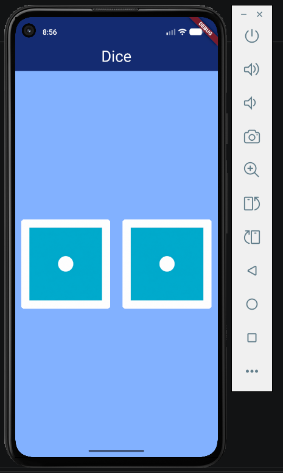

# Dice

O **Dice** é um aplicativo desenvolvido em Flutter que simula o lançamento de dois dados.

Na tela, são exibidos dois dados. Ao clicar em qualquer um deles, os números dos dois dados são alterados aleatoriamente, criando um novo resultado a cada lançamento.

Este projeto também foi uma oportunidade para aprender conceitos importantes, como:

- uso de variáveis;
- criação e utilização de funções;
- importação e uso de bibliotecas em um projeto Flutter;
- diferença prática entre widgets `Stateless` e `Stateful`.

## Captura de tela

